# After Effects MCP Server - Project Documentation

## Table of Contents

- [1. Project Overview](#1-project-overview)
- [2. Architecture](#2-architecture)
- [3. System Components](#3-system-components)
- [4. Communication Flow](#4-communication-flow)
- [5. Project Structure](#5-project-structure)
- [6. Tech Stack](#6-tech-stack)
- [7. MCP Server (index.ts)](#7-mcp-server-indexts)
- [8. Bridge Panel (mcp-bridge-auto.jsx)](#8-bridge-panel-mcp-bridge-autojsx)
- [9. Python Automation Layer](#9-python-automation-layer)
- [10. Installation & Setup](#10-installation--setup)
- [11. Data Flow & File-Based IPC](#11-data-flow--file-based-ipc)
- [12. Available MCP Tools](#12-available-mcp-tools)
- [13. Effect Templates](#13-effect-templates)
- [14. Use Case: Video Ad Automation](#14-use-case-video-ad-automation)
- [15. Error Handling & Reliability](#15-error-handling--reliability)
- [16. Configuration Reference](#16-configuration-reference)

---

## 1. Project Overview

The **After Effects MCP Server** is a bridge system that enables AI assistants (like Claude) and external applications to programmatically control **Adobe After Effects** through the **Model Context Protocol (MCP)**. It abstracts After Effects' scripting complexity into a clean, tool-based interface.

### What Problem Does It Solve?

Adobe After Effects is a powerful motion graphics tool, but automating it requires deep knowledge of ExtendScript (a legacy JavaScript dialect). This project provides:

- A **standardized API** (via MCP) for controlling After Effects
- **AI-powered video automation** - Claude or other LLMs can create/modify compositions
- **Batch variation generation** - Create multiple versions of video ads programmatically
- **Cross-language support** - Control AE from TypeScript, Python, or any MCP client

### High-Level Architecture Diagram

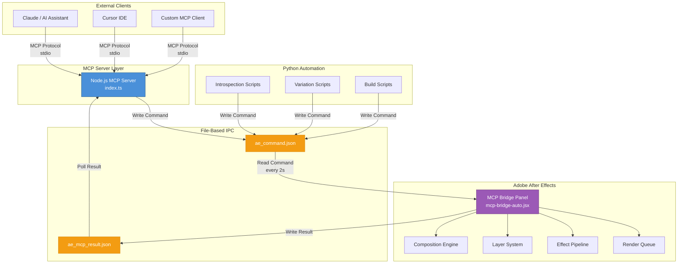

---

## 2. Architecture

The system follows a **three-tier architecture** connected through file-based inter-process communication (IPC).

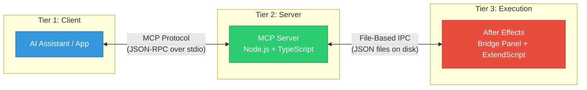

### Why File-Based IPC?

| Approach | Pros | Cons |
|----------|------|------|
| **File-Based (chosen)** | Works with AE's sandboxed scripting, simple, debuggable, reliable | Slower (2s polling), disk I/O |
| Network Sockets | Faster, real-time | AE ExtendScript has limited socket support |
| CEP/UXP Panels | Native integration | Complex setup, version-dependent |

The file-based approach was chosen because After Effects' ExtendScript has reliable file I/O but limited networking capabilities. JSON files on disk provide a universal, debuggable bridge.

---

## 3. System Components

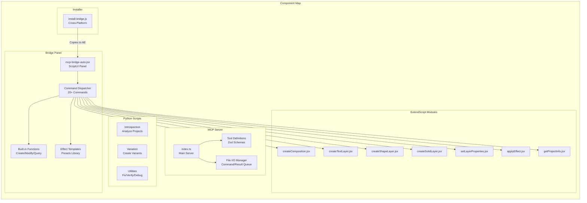

---

## 4. Communication Flow

### Command Lifecycle

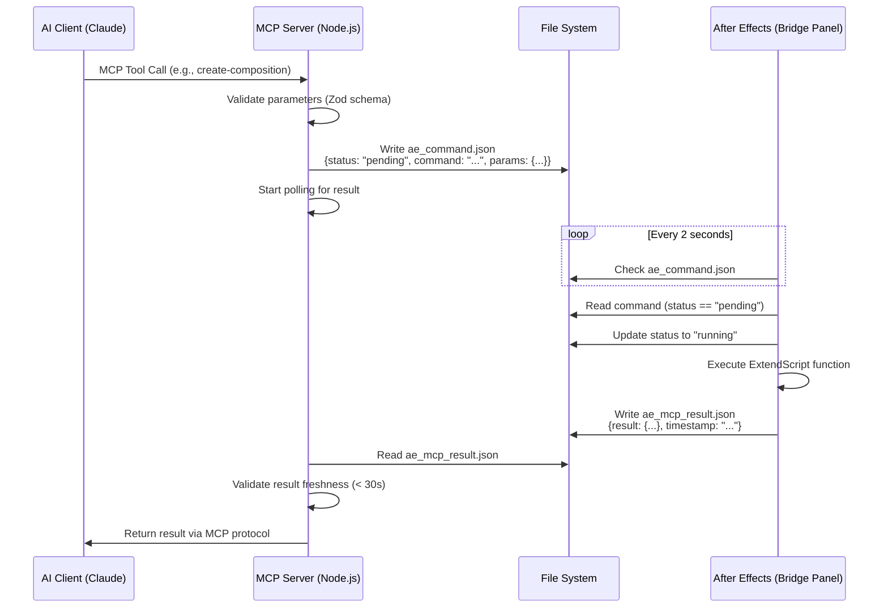

### Command Status State Machine

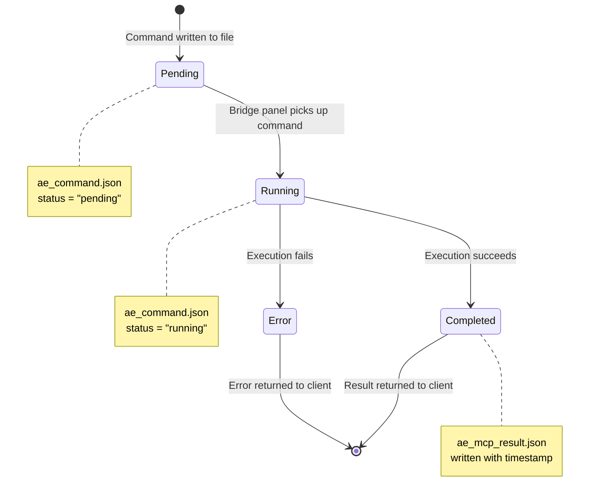

---

## 5. Project Structure

```
after-effects-mcp/
│
├── src/                              # Source code (TypeScript + ExtendScript)
│   ├── index.ts                      # Main MCP server implementation
│   └── scripts/                      # ExtendScript files for After Effects
│       ├── mcp-bridge-auto.jsx       # Bridge panel (core - 2400+ lines)
│       ├── createComposition.jsx     # Composition creation
│       ├── createTextLayer.jsx       # Text layer creation
│       ├── createShapeLayer.jsx      # Shape layer creation
│       ├── createSolidLayer.jsx      # Solid/adjustment layer creation
│       ├── setLayerProperties.jsx    # Layer property modification
│       ├── getProjectInfo.jsx        # Project metadata retrieval
│       ├── getLayerInfo.jsx          # Layer information retrieval
│       ├── listCompositions.jsx      # Composition listing
│       ├── applyEffect.jsx           # Effect application
│       └── applyEffectTemplate.jsx   # Effect preset application
│
├── build/                            # Compiled output (generated by tsc)
│
├── assets/                           # Project assets & AE project files
│   ├── new-file-to-modify/           # Laptop project files
│   │   └── Laptop 10 Sec folder/    # Main AE project & footage
│   └── new-video-assets/             # Additional assets (backgrounds, etc.)
│
├── guideline-doc/                    # Internal documentation/guidelines
│
├── *.py                              # Python automation scripts (root)
│   ├── create_variation.py           # Generic composition variation creator
│   ├── create_laptop10sec_variation.py  # Laptop-specific variation
│   ├── introspect_laptop10sec.py     # Composition structure analyzer
│   ├── introspect_bg_comps.py        # Background comp analyzer
│   ├── build_flipkart_reveal.py      # Flipkart reveal animation builder
│   └── ...                           # Other utility scripts
│
├── *.jsx                             # Standalone ExtendScript files (root)
│   ├── flipkart_sale_v2.jsx          # Full Flipkart sale animation
│   ├── flipkart-reveal-setup.jsx     # Reveal animation setup
│   └── ...                           # Debug/test scripts
│
├── package.json                      # Node.js dependencies & scripts
├── tsconfig.json                     # TypeScript configuration
├── install-bridge.js                 # Bridge panel installer
├── .gitignore                        # Git ignore rules
├── LICENSE                           # MIT License
└── README.md                         # Project readme
```

### File Type Breakdown

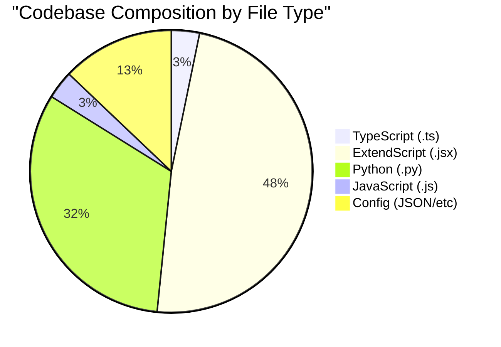

---

## 6. Tech Stack

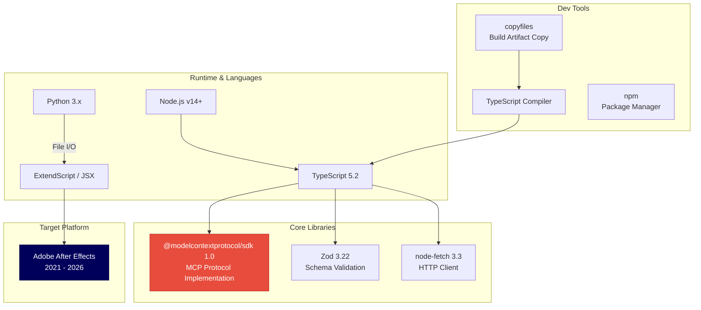

| Technology | Version | Purpose |
|------------|---------|---------|
| Node.js | >= 14.x | Runtime for MCP server |
| TypeScript | ^5.2.2 | Type-safe server code |
| MCP SDK | ^1.0.0 | Model Context Protocol implementation |
| Zod | ^3.22.2 | Runtime schema validation for tool parameters |
| node-fetch | ^3.3.2 | HTTP client (for potential external APIs) |
| ExtendScript | ES3-based | After Effects native scripting |
| Python | 3.x | High-level automation scripts |
| copyfiles | ^2.4.1 | Cross-platform file copying during build |

---

## 7. MCP Server (index.ts)

The MCP server is the central hub that translates MCP tool calls into After Effects commands.

### Server Initialization Flow

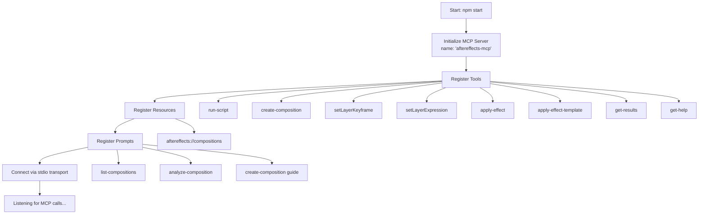

### Key Functions

| Function | Purpose |
|----------|---------|
| `writeCommandFile(command, params)` | Serializes command + params to `ae_command.json` with "pending" status |
| `waitForBridgeResult(timeout)` | Polls `ae_mcp_result.json` until result appears or timeout (default 5s) |
| `readResultsFromTempFile()` | Reads and parses the result JSON file |
| `clearResultsFile()` | Clears stale results before new commands |

### Tool Parameter Validation

All MCP tools use **Zod schemas** for parameter validation at runtime:

```typescript
// Example: create-composition tool schema
{
  name: z.string(),          // Composition name
  width: z.number(),         // Width in pixels (e.g., 1920)
  height: z.number(),        // Height in pixels (e.g., 1080)
  duration: z.number(),      // Duration in seconds
  frameRate: z.number()      // Frames per second (e.g., 30)
}
```

---

## 8. Bridge Panel (mcp-bridge-auto.jsx)

The bridge panel is the heart of the system - a ScriptUI panel running inside After Effects that continuously monitors for commands and executes them.

### Panel Lifecycle

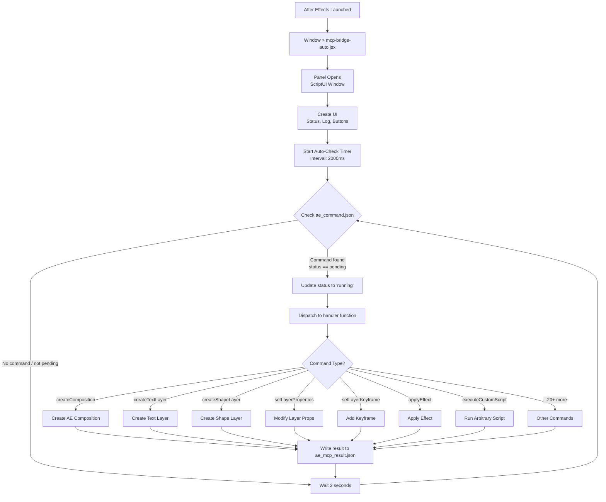

### Supported Commands

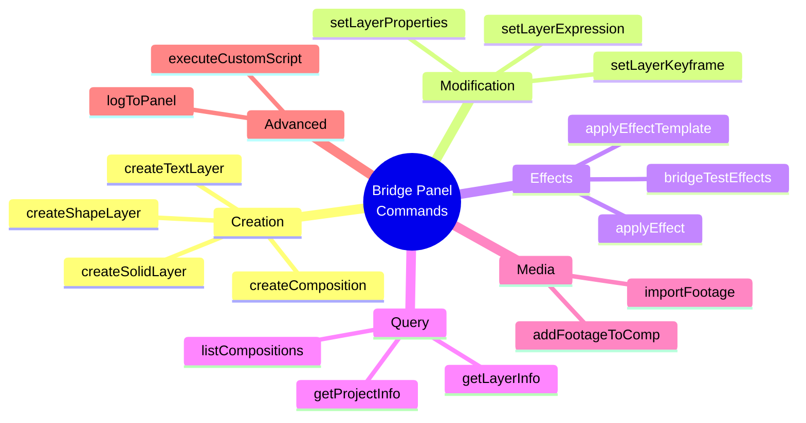

### Layer Property System

The `setLayerProperties` function can modify these properties on any layer:

| Category | Properties |
|----------|------------|
| **Transform** | position, scale, rotation, anchorPoint, opacity |
| **Timing** | inPoint, outPoint, startTime |
| **Text** | text, fontSize, font, fillColor, justification |
| **Layer** | name, label, enabled, solo, shy |
| **3D** | threeDLayer, position (x,y,z) |

---

## 9. Python Automation Layer

The Python scripts provide high-level automation workflows that orchestrate multiple After Effects operations.

### Automation Workflow

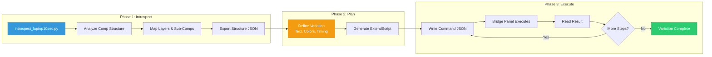

### Python Script Reference

| Script | Purpose | Input | Output |
|--------|---------|-------|--------|
| `introspect_laptop10sec.py` | Analyze "Laptop 10 Sec" composition | AE project file | Layer tree structure |
| `introspect_bg_comps.py` | Analyze background compositions | AE project | Background layer details |
| `introspect_subcomps.py` | Examine nested sub-compositions | AE project | Sub-comp hierarchy |
| `create_variation.py` | Create generic composition variation | Variation config | New AE composition |
| `create_laptop10sec_variation.py` | Create Laptop 10s variant | Text/timing params | Modified composition |
| `build_flipkart_reveal.py` | Build Flipkart reveal animation | Animation params | Animated composition |
| `fix_timing.py` | Adjust animation timing | Timing corrections | Updated keyframes |
| `verify_variation.py` | Validate created variations | Expected vs actual | Pass/fail report |

---

## 10. Installation & Setup

### Installation Flow

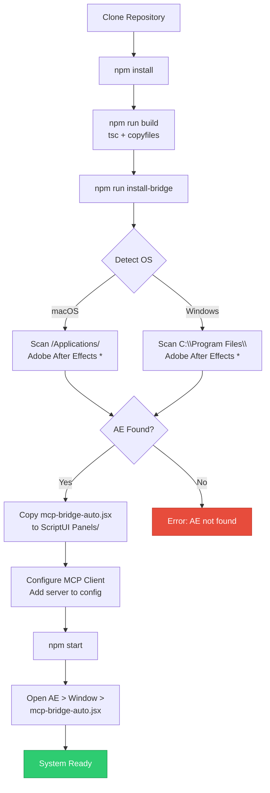

### MCP Client Configuration

Add this to your MCP client configuration (Claude Desktop, Cursor, etc.):

```json
{
  "mcpServers": {
    "AfterEffectsMCP": {
      "command": "node",
      "args": ["/path/to/after-effects-mcp/build/index.js"]
    }
  }
}
```

### Supported After Effects Versions

| Version | Year | Status |
|---------|------|--------|
| AE 2021 | v18.x | Supported |
| AE 2022 | v22.x | Supported |
| AE 2023 | v23.x | Supported |
| AE 2024 | v24.x | Supported |
| AE 2025 | v25.x | Supported (floating panel only) |
| AE 2026 | v26.x | Supported (floating panel only) |

---

## 11. Data Flow & File-Based IPC

### File Locations

All IPC happens through files in `~/Documents/ae-mcp-bridge/`:

```
~/Documents/ae-mcp-bridge/
├── ae_command.json       # Commands from server/scripts to AE
└── ae_mcp_result.json    # Results from AE back to server/scripts
```

### Command File Format (ae_command.json)

```json
{
  "command": "createTextLayer",
  "params": {
    "compName": "My Composition",
    "text": "Hello World",
    "fontSize": 72,
    "fontName": "Arial",
    "color": [1, 1, 1],
    "position": [960, 540]
  },
  "status": "pending",
  "timestamp": "2026-02-16T10:30:00.000Z"
}
```

### Result File Format (ae_mcp_result.json)

```json
{
  "result": {
    "success": true,
    "layerName": "Hello World",
    "layerIndex": 1,
    "compName": "My Composition"
  },
  "timestamp": "2026-02-16T10:30:02.000Z"
}
```

### Timing Diagram

```mermaid
gantt
    title Command Execution Timeline
    dateFormat ss
    axisFormat %S s

    section MCP Server
    Write command file       :a1, 00, 1s
    Polling for result       :a2, 01, 4s

    section File System
    Command file on disk     :b1, 00, 3s
    Result file on disk      :b2, 03, 2s

    section Bridge Panel
    Detect command (2s poll) :c1, 02, 1s
    Execute in AE            :c2, 02, 1s
    Write result             :c3, 03, 1s
```

### Timing Constants

| Parameter | Value | Description |
|-----------|-------|-------------|
| Poll Interval | 2000ms | How often bridge checks for commands |
| Result Timeout | 5000ms | Max wait for result before timeout |
| Stale Threshold | 30000ms | Result older than this triggers warning |

---

## 12. Available MCP Tools

### Tool Overview

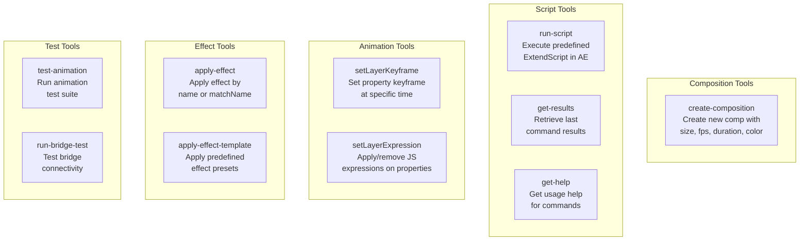

### Detailed Tool Reference

| Tool | Parameters | Description |
|------|-----------|-------------|
| `create-composition` | name, width, height, duration, frameRate | Creates a new AE composition |
| `run-script` | scriptName, params (optional) | Runs a predefined ExtendScript file |
| `setLayerKeyframe` | compName, layerName, propertyName, time, value | Sets a keyframe on a layer property |
| `setLayerExpression` | compName, layerName, propertyName, expression, remove | Applies or removes an expression |
| `apply-effect` | compName, layerName, effectName, matchName | Applies a native AE effect |
| `apply-effect-template` | compName, layerName, templateName, params | Applies a predefined effect template |
| `get-results` | (none) | Returns the last command's result |
| `get-help` | (none) | Returns help documentation |

---

## 13. Effect Templates

The bridge panel includes predefined effect templates for common operations:

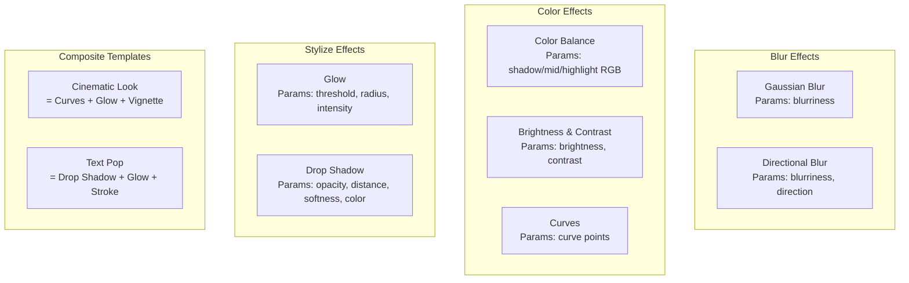

| Template | Effect(s) Applied | Key Parameters |
|----------|------------------|----------------|
| Gaussian Blur | Gaussian Blur | blurriness (px) |
| Directional Blur | CC Directional Blur | blurriness, direction (degrees) |
| Color Balance | Color Balance (HLS) | shadow/midtone/highlight RGB values |
| Brightness & Contrast | Brightness & Contrast | brightness (-150 to 150), contrast (-150 to 150) |
| Curves | Curves | Channel curve control points |
| Glow | Glow | threshold, radius, intensity |
| Drop Shadow | Drop Shadow | opacity, distance, softness, color |
| Cinematic Look | Curves + Glow + Vignette | Combined parameters |
| Text Pop | Shadow + Glow + Stroke | Combined parameters |

---

## 14. Use Case: Video Ad Automation

The project is actively used to automate video advertisement creation (Dell laptop promotions, Flipkart campaigns).

### Ad Creation Pipeline

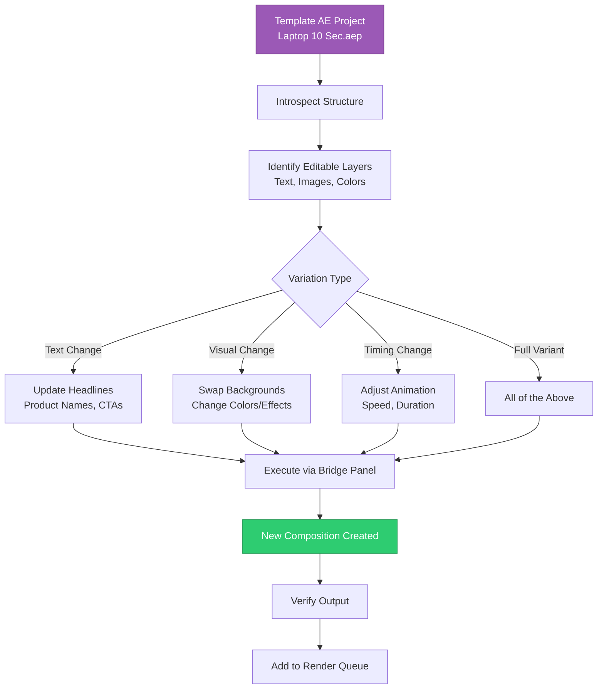

### Project Composition Structure

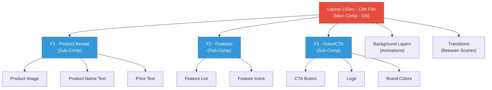

---

## 15. Error Handling & Reliability

### Error Handling Strategy

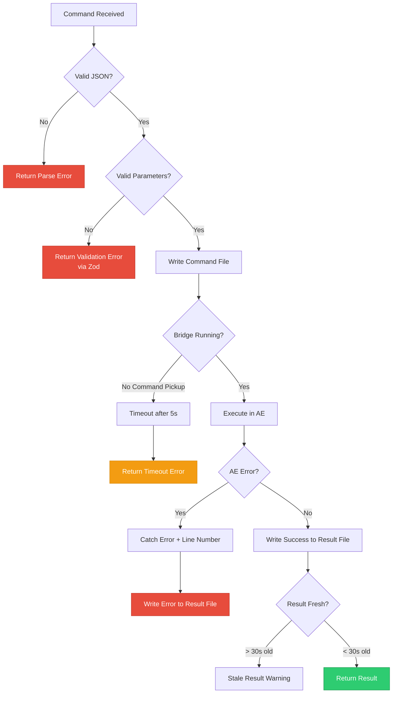

### Reliability Mechanisms

| Mechanism | Description |
|-----------|-------------|
| **Status Tracking** | Commands have `pending` -> `running` -> `completed` status to prevent double-execution |
| **Timestamp Validation** | Results include timestamps; stale results (>30s) trigger warnings |
| **Error Capture** | ExtendScript try/catch blocks capture errors with line numbers |
| **File Locking** | Status field prevents concurrent command execution |
| **Graceful Fallback** | Missing result files return informative error messages, not crashes |
| **Logging** | Bridge panel has a built-in log UI for debugging |

---

## 16. Configuration Reference

### npm Scripts

| Script | Command | Description |
|--------|---------|-------------|
| `build` | `tsc && copyfiles -u 1 "src/scripts/**/*" build` | Compile TS + copy JSX scripts to build/ |
| `start` | `node build/index.js` | Start the MCP server |
| `install-bridge` | `node install-bridge.js` | Install bridge panel to After Effects |
| `postinstall` | `npm run build` | Auto-build after npm install |

### TypeScript Configuration

| Setting | Value | Purpose |
|---------|-------|---------|
| target | ES2022 | Modern JS output |
| module | Node16 | ES module support |
| strict | true | Full type checking |
| outDir | ./build | Output directory |

### Environment Requirements

| Requirement | Minimum | Recommended |
|-------------|---------|-------------|
| Node.js | v14.x | v18+ |
| After Effects | 2021 | 2024+ |
| OS | macOS / Windows | Any |
| Disk Space | ~50MB | ~100MB (with assets) |

---

## Appendix: Quick Reference Card

```
START SERVER:       npm start
BUILD PROJECT:      npm run build
INSTALL TO AE:      npm run install-bridge

COMMAND FILE:       ~/Documents/ae-mcp-bridge/ae_command.json
RESULT FILE:        ~/Documents/ae-mcp-bridge/ae_mcp_result.json

BRIDGE PANEL:       After Effects > Window > mcp-bridge-auto.jsx
POLL INTERVAL:      2 seconds
RESULT TIMEOUT:     5 seconds
```

---

*This documentation was generated for the After Effects MCP Server project (v1.0.0).*
